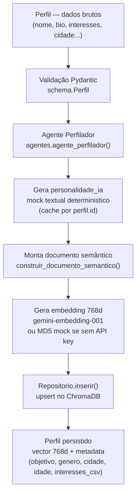
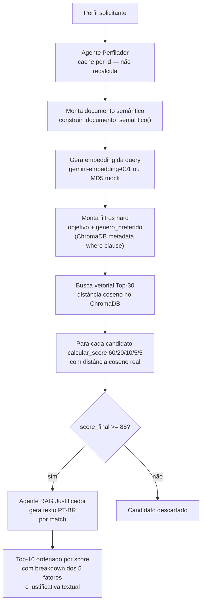

# SwipesBurnout — Relatório CP5

**Disciplina:** Processamento de Linguagem Natural  
**Curso:** Engenharia de Software — FIAP  
**Grupo:** Matheus Barbosa (RM561085), Guilherme Henrique (RM559977), Vitor Adauto (RM560247)

---

## 1. O que o sistema faz

SwipesBurnout é um sistema de matchmaking semântico. O usuário cadastra um perfil com nome, cidade, bio, interesses e preferências de relacionamento. O sistema retorna os 10 candidatos mais compatíveis do banco, cada um com um score de 0 a 100, o detalhamento de como esse score foi calculado, e uma justificativa textual gerada por IA.

A diferença em relação a sistemas baseados em regras é que a compatibilidade parte do embedding da bio, texto livre escrito pelo usuário. Não cruzamos "gosta de cinema" com "gosta de cinema". Comparamos o vetor semântico de tudo que o usuário escreveu sobre si mesmo com os vetores de todos os outros perfis, e os mais próximos no espaço vetorial aparecem no topo da lista.

O sistema foi implementado como pacote Python (`swipes_burnout/`) com interface Streamlit em `app/streamlit_app.py` e notebook de demonstração em `notebook/demo_cp5.ipynb`.

---

## 2. Dados usados

### 2.1 Estrutura do perfil

O modelo de dados é o `Perfil` em `swipes_burnout/schema.py`, validado por Pydantic. Os campos se dividem conforme a função que exercem no pipeline:

**Campos de filtro hard** — armazenados como metadados no ChromaDB, usados para restringir o pool antes da busca vetorial:

| Campo | Tipo | Valores |
|---|---|---|
| `objetivo` | Literal | `namoro`, `casual`, `amizade` |
| `genero` | Literal | `masculino`, `feminino`, `nao_binario`, `outro` |
| `genero_preferido` | Literal | os mesmos acima + `todos` |
| `idade` | int | 18 a 99 |
| `faixa_etaria_pref` | tuple (int, int) | faixa aceita no candidato |
| `cidade` | str | texto livre |

**Campos semânticos** — concatenados em documento de texto antes de gerar o embedding:

| Campo | Tipo | Descrição |
|---|---|---|
| `bio` | str (mín. 1 char) | Apresentação pessoal em texto livre |
| `interesses` | list[str] | Hobbies e atividades de interesse |
| `personalidade_ia` | str | Gerado pelo Agente Perfilador antes da ingestão |

**Identificação:**

| Campo | Tipo | Detalhe |
|---|---|---|
| `id` | str | UUIDv4 gerado automaticamente |
| `nome` | str | Nome do usuário |

### 2.2 O documento semântico

Os campos semânticos não vão direto para o modelo de embedding. A função `construir_documento_semantico()` os monta em um parágrafo de texto antes:

```
Perfil: {nome}, {idade} anos, {cidade}.
Objetivo: {objetivo}.
Bio: {bio}
Interesses: {interesses separados por vírgula}
Personalidade IA: {personalidade_ia}
```

Esse texto é o que o modelo `gemini-embedding-001` (Google) recebe como entrada. O resultado é um vetor de 768 dimensões armazenado no ChromaDB.

### 2.3 O banco de perfis sintéticos

O banco foi populado com 390 perfis gerados por `gerar_pool_perfis(seed=42)` em `seed_data.py`. A seed fixa garante que a mesma chamada sempre produza os mesmos perfis — importante para reprodutibilidade dos experimentos.

A composição do pool:

| Tipo | Quantidade | Características principais |
|---|---|---|
| Gate masculino | 45 | masculino, namoro, SP/RJ, 4 interesses do pool de alta compatibilidade |
| Gate feminino | 45 | feminino, namoro, SP/RJ/Campinas/BH, 4 interesses compatíveis com perfis masculinos |
| Alta compatibilidade | 60 | 3+ interesses em comum com o perfil de teste (Ana Lima), objetivo namoro |
| Diversidade | 240 | todos os objetivos, 32 cidades brasileiras, idades 18-60, gêneros variados |

Total: 390 perfis, 32 cidades distintas.

Os "perfis gate" têm uma função específica: garantir que o sistema retorne pelo menos 10 matches com score >= 85 mesmo quando o embedding é o mock de MD5 (sem API key), que não captura semântica real. Com embedding de API real, qualquer perfil com bio e interesses compatíveis pode atingir o threshold.

---

## 3. Por que esses dados para o cruzamento

### 3.1 Por que usar embedding de texto livre em vez de campos estruturados

A abordagem estruturada mais simples seria cruzar perfis por regras: mesma cidade, mesmos interesses, mesma faixa etária. Funciona para filtros de exclusão, mas é ruim para medir compatibilidade — dois perfis podem ter os mesmos três interesses e nada em comum além disso.

Texto livre em bio captura nuances que campos estruturados não conseguem. Alguém que escreve "amo trilhas longas e acampar sem sinal de celular" tem perfil semântico diferente de quem escreve "gosto de natureza e estar ao ar livre", mesmo que ambos marquem "natureza" no campo de interesses. O modelo de embedding transforma essa diferença em distância vetorial.

Por isso o embedding da bio (e da personalidade gerada pelo Perfilador) responde por 60% do score. Os outros 40% são fatores estruturados que complementam, não substituem, a comparação semântica.

### 3.2 Por que o Agente Perfilador enriquece o perfil antes do embedding

Perfis com bio de duas linhas e perfis com parágrafos longos teriam pesos diferentes no vetor de embedding sem essa etapa. O Perfilador adiciona um parágrafo padronizado de personalidade antes de vetorizar, baseado nos dados estruturados do perfil. Isso reduz a influência do comprimento da bio e adiciona contexto inferido (traços de personalidade, estilo de vida) que o usuário pode não ter escrito explicitamente.

Em produção, esse agente chamaria o Gemini Vision com a foto do perfil e a bio. Na implementação atual usa um mock textual determinístico: mesmo input sempre produz o mesmo output, o resultado é cacheado por `perfil.id`.

### 3.3 A lógica dos pesos 60/20/10/5/5

O score final é calculado por `calcular_score()` em `swipes_burnout/scoring.py`:

```
score_final = score_semantico * 0.60
            + score_interesses          (já em escala 0-20, contribuição máxima direta)
            + score_objetivo  * 0.10
            + score_idade     * 0.05
            + score_geografia * 0.05
```

Cada componente:

**Score semântico (60%):** converte a distância coseno retornada pelo ChromaDB (escala [0,2]) para similaridade [0,100] pela fórmula `(1 - distancia/2) * 100`. Responde pela maior parte do score porque o embedding de bio captura afinidade de valores e estilo de vida que campos estruturados não conseguem medir. Uma pessoa que escreve de forma parecida provavelmente pensa de forma parecida — é uma hipótese, mas parece razoável.

**Score de interesses (20%):** `min(interesses_em_comum * 5, 20)`. Cada hobby compartilhado vale 5 pontos, teto em 4 interesses. Quatro em comum já dão os 20 pontos máximos desse fator. A intenção era que interesses complementassem a semântica sem substituí-la — dois perfis com interesses idênticos e bios completamente diferentes ainda precisam ter boa similaridade vetorial para aparecer nos matches.

**Score de objetivo (10%):** binário. Objetivo diferente zera esse fator e, antes disso, elimina o candidato nos filtros hard do ChromaDB. Um perfil buscando "namoro" não entra nem na busca vetorial quando o solicitante quer "amizade".

**Score de idade (5%):** `max(0, 100 - abs(idade_a - idade_b) * 2)`. Dois pontos por ano de diferença. Peso pequeno porque a faixa etária preferida já é declarada no cadastro. A penalidade existe para que diferenças grandes não sejam completamente ignoradas, não para ser decisiva.

**Score de geografia (5%):** binário por nome de cidade. Peso baixo por limitação técnica: comparar strings de cidade é impreciso. Mesmo estado, cidades vizinhas — tudo conta como zero. Distância real em km seria mais útil, mas ficou para V2.

O threshold de 85 não foi arbitrário. Com os pesos definidos, atingir 85 requer similaridade semântica razoável (acima de ~50%) combinada com pelo menos objetivo compatível e alguns interesses em comum. Scores abaixo disso normalmente indicam candidatos que têm um fator favorável mas estão distantes nos demais — matches que na prática provavelmente não funcionariam.

### 3.4 Por que ChromaDB para armazenar os vetores

O ChromaDB foi escolhido porque permite armazenar o vetor de embedding e os metadados estruturados no mesmo documento. A busca vetorial pode ser filtrada por metadados antes de calcular similaridade — o que chamamos de "filtros hard". Isso é importante porque comparar o vetor de um perfil feminino buscando namoro com 300 vetores de perfis masculinos buscando amizade não faz sentido e desperdiça processamento.

A operação de busca funciona assim: primeiro o ChromaDB filtra a coleção pelos campos de metadata (`objetivo`, `genero`) e só então executa a busca por vizinhança no espaço vetorial reduzido. O resultado são os 30 candidatos mais próximos semanticamente entre os que já passaram nos filtros hard.

---

## 4. Diagrama: pipeline de ingestão

O pipeline de ingestão transforma um perfil bruto em entrada no banco vetorial. Implementado em `swipes_burnout/ingestao.py`.



Pontos relevantes:

- A ingestão é idempotente: re-ingerir o mesmo `id` substitui o registro existente sem duplicar. Isso permite reprocessar o pool inteiro sem inflacionar o banco.
- O ChromaDB armazena dois tipos de dado por perfil: o vetor (para busca por similaridade) e os metadados em campos primitivos (para filtros). Listas não são aceitas como metadata — os interesses são gravados como string CSV (`"musica,viagem,cinema"`) e parseados na leitura.
- Quando `GOOGLE_API_KEY` está ausente, o embedding é gerado por hash MD5 da string de texto, produzindo 768 floats determinísticos. Isso permite rodar o sistema completamente offline, mas a qualidade dos matches depende de sobreposição de interesses e fatores estruturais, não de semântica real.

---

## 5. Diagrama: pipeline de consumo

O pipeline de consumo recebe um perfil solicitante e retorna os matches. Implementado principalmente em `swipes_burnout/agentes.py` via `buscar_matches()`.



O grafo LangGraph que orquestra os três agentes tem fluxo linear:

```
START → perfilador → casamenteiro → rag_justificador → END
```

O estado compartilhado entre os nós (`AgentState`) é um `TypedDict` com campos `perfil`, `candidatos`, `matches`, `justificativas` e `erro`. Cada nó recebe o estado inteiro, faz sua parte, e devolve o estado atualizado.

O K=30 na busca vetorial existe porque com threshold de 85 nem todos os candidatos semanticamente próximos passam pelos fatores estruturais. Buscar 30 e filtrar garante mais candidatos válidos do que buscar 10 e esperar que todos alcancem o threshold.

---

## 6. Melhorias futuras

**Distância geográfica real.** O score de geografia atual compara strings de cidade: São Paulo = São Paulo recebe 100 pontos, São Paulo ≠ Guarulhos recebe 0. Na prática, cidades vizinhas são tratadas como incompatíveis. Calcular distância em quilômetros (via API de geocoding ou banco de coordenadas) e definir uma penalidade por distância seria muito mais útil.

**Feedback loop nos pesos.** Quando um usuário aceita ou rejeita um match, essa informação não é registrada. O sistema não aprende. Guardar essas ações em banco relacional e usá-las para ajustar os pesos do scoring — individualmente por usuário ou globalmente — transformaria o sistema em algo que melhora com uso.

**Backend API REST.** A arquitetura atual é monolítica: Streamlit serve tanto a interface quanto executa o pipeline. Em produção com múltiplos usuários, isso não funciona. FastAPI com rotas de ingestão e consumo, autenticação JWT e banco vetorial como serviço separado seria o caminho.

**Banco vetorial em serviço.** ChromaDB em modo embedded (arquivo local SQLite) é prático para desenvolvimento mas inviável em deploy com múltiplos workers. PostgreSQL com extensão pgvector, Pinecone ou Weaviate resolveriam isso, com a vantagem de suportar backups gerenciados e escalabilidade horizontal.

**Verificação de perfis falsos.** Atualmente qualquer texto é aceito como bio sem validação de autenticidade. Classificar se o conteúdo parece gerado automaticamente, e detectar imagens sintéticas antes de exibir, reduziria perfis falsos no banco.

**Análise pós-match.** O sistema encerra após entregar os matches. Não há dados sobre quais matches geraram conversas, ou quais conversas foram bem avaliadas pelos usuários. Esse loop fechado seria necessário para avaliar se o score realmente prediz compatibilidade — e para ajustar o que não prediz.
